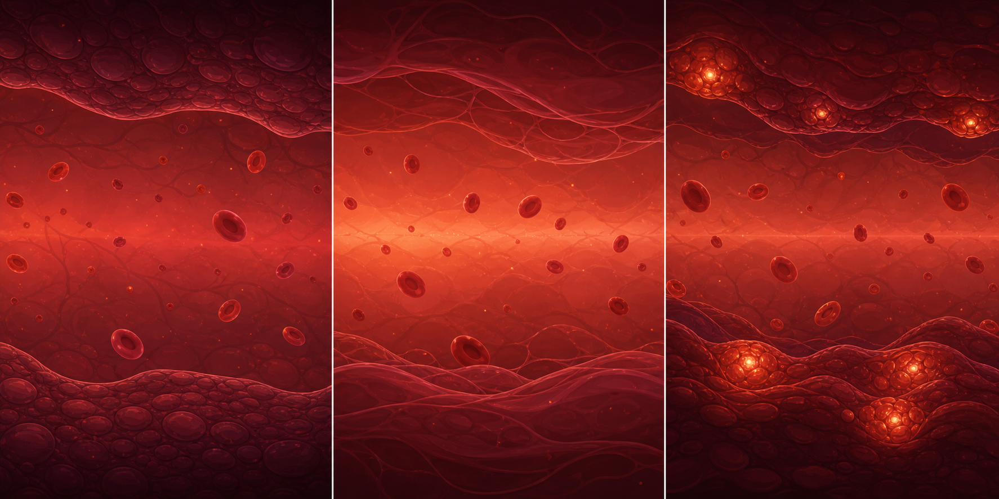
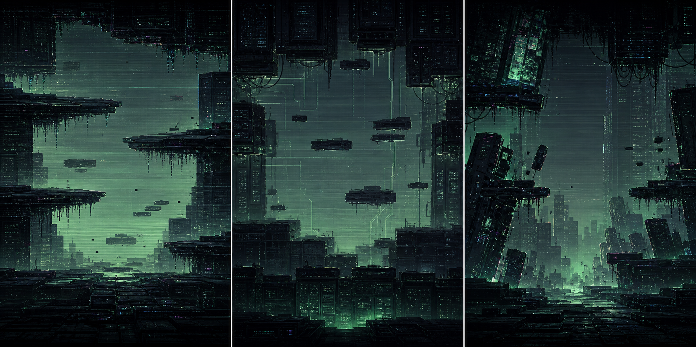
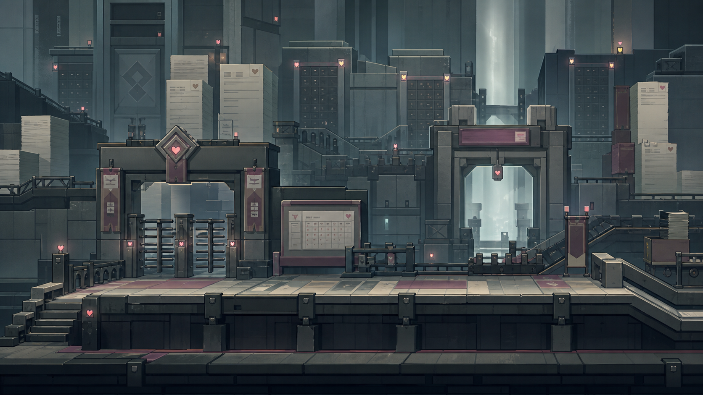
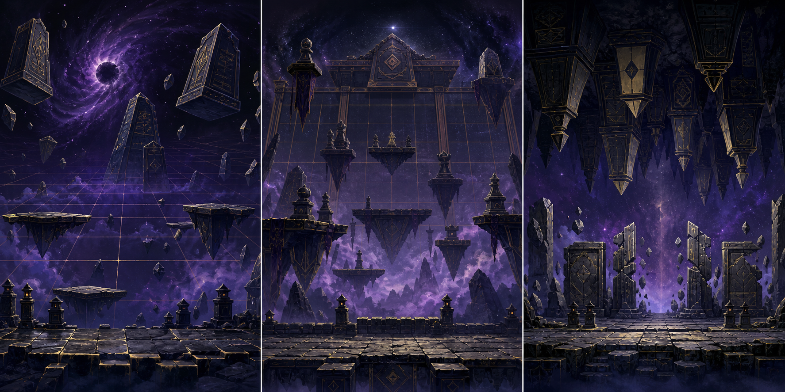

# ステージビジュアルコンセプト

この資料は、ステージ作り込み時の見た目とレイアウト判断の基準にする。
ここに置いた画像は実装用素材ではなく、ゲーム内描画・地形・背景・セットピースへ翻訳するための参照画像。

現在の Stage1 実装はまだ最終見た目ではない。以後の修正では、この資料の方向へ寄せる。

## 共通方針

- 横スクロールのプレイ画面として、中央の移動・弾幕・敵の視認性を最優先する。
- ランドマーク、ゲート、砲台台座、中ボス戦闘エリアは `terrain_layout` / `world_events` の `world_x` 固定配置で作る。
- 背景は雰囲気を出すが、弾・敵・アイテムより主張しない。
- 破壊可能地形は壁全体ではなく、小さな出っ張り、台座、ゲート、掘削対象として置く。
- 生成画像をそのままゲームに貼るのではなく、低解像度でも読める形・色・シルエットへ分解して実装する。

## Stage1: 発熱回廊

採用方向:

- 基準は中央案。赤血球が浮く、明るめで奥行きのある血管回廊。
- 左案の赤血球感は採用するが、壁の粒状感・グロさは抑える。
- 右案の発光する腫れ・膿っぽい塊は強すぎるので、局所アクセントに留める。

ゲーム内へ落とす要素:

- 背景: 楕円の赤血球、薄い血管ライン、赤い霞。
- 上下壁: 有機的な曲線。ただし凸凹を細かくしすぎない。
- 破壊可能地形: 血栓・細胞塊。画面端まで穴を開ける壁ではなく、通路に少し出た小さな詰まり。
- 砲台台座: 血栓が固まった足場。汎用の茶色い岩や灰色ブロックにしない。

Stage1 レイアウトの戻りどころ:

| world_x | 区間 | 意図 |
|---:|---|---|
| 0-700 | 導入 | 広い通路。赤血球背景と発熱回廊の雰囲気を見せる |
| 700-1500 | 小さな詰まり | 上下に小さな血栓。壊すとアイテムが出る可能性 |
| 1500-2350 | 砲台台座 | 血栓台座に砲台・Crawler を固定配置 |
| 2350-3050 | 血栓ゲート | 上下から挟む短い封鎖。中央通路は残す |
| 3050-3400 | ボス前 | 敵密度を落とし、BGMを保ったまま呼吸を置く |

## Stage2: ミーム汚染 / 控えめサイバー

採用方向:

- 基準は中央案の落ち着いた青緑トーン。
- 右案のサイバー感、斜めの崩れ、ノイズ表現を少量混ぜる。
- 背景として色が強すぎるネオンや高彩度マゼンタは避ける。

ゲーム内へ落とす要素:

- 背景: 薄い走査線、遠景の壊れた都市ブロック、低彩度の緑/青ノイズ。
- 地形: 黒いデータ塊、壊れたパネル、浮遊する足場。
- セットピース: ノイズゲート、通信障害の壁、画面端ではなく通路内に置かれた崩落ブロック。

## Stage3: 審査ゲート / 労働要塞

採用方向:

- 追加版中央を基準にした、抽象的な審査ゲート・労働要塞。
- ハートは小さなランプ、スタンプ、表示灯程度に留める。
- 巨大なハート、恋愛イベント会場、プロフィールカードだらけの画面にはしない。

ゲーム内へ落とす要素:

- 背景: 事務的な塔、書類束、審査窓口、ターンスタイル、カレンダーグリッド。
- 地形: コンクリートと金属の直線的な足場。
- セットピース: ゲート、審査台、砲台付き監視塔、中ボス用の封鎖エリア。

## Stage4: 将棋深淵 / ラスボス玉座

採用方向:

- 道中は左案。宇宙・盤面・浮遊する駒石碑の広がりを使う。
- ラスボスは中央案。巨大な盤面と玉座感を強める。
- 右案の天井から迫る圧迫感は一部の危険区間に使う。

ゲーム内へ落とす要素:

- 背景: 紫の深淵、薄い将棋盤グリッド、遠景の浮遊駒。
- 地形: 黒金の石板、浮遊足場、駒型の柱。
- ラスボス前: 盤面が中央に収束し、ボス戦エリアへ入る明確な門を作る。

