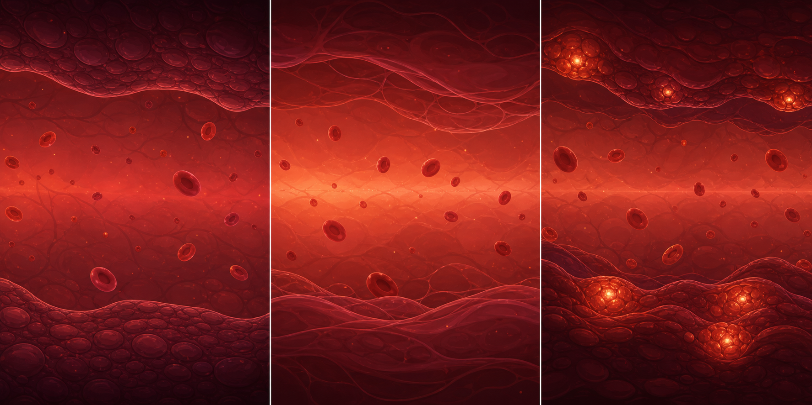
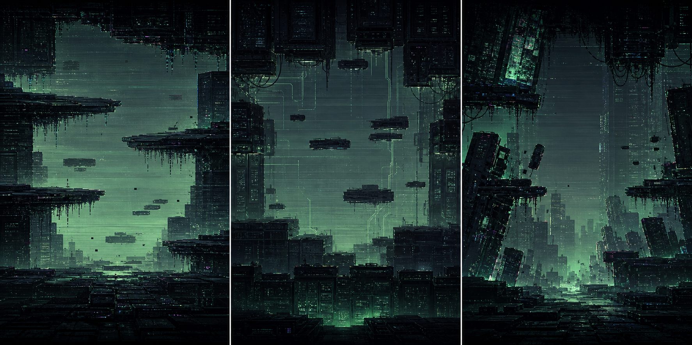
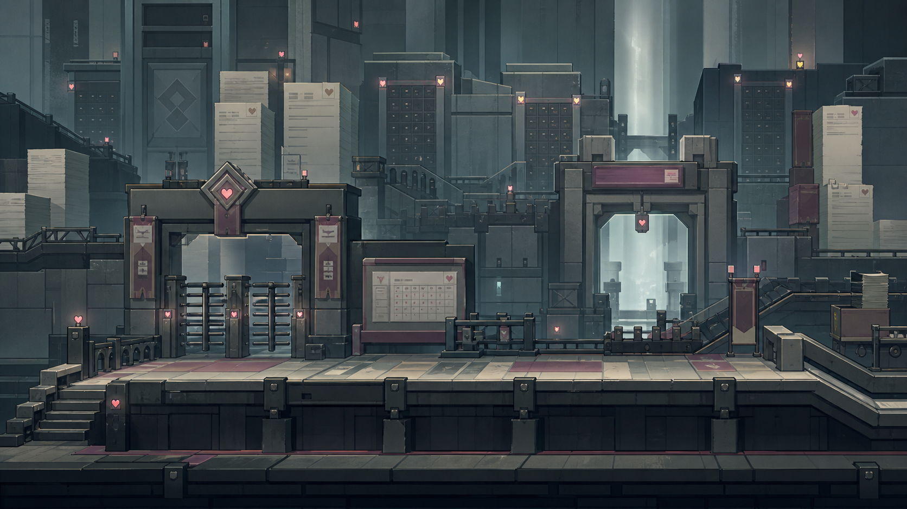
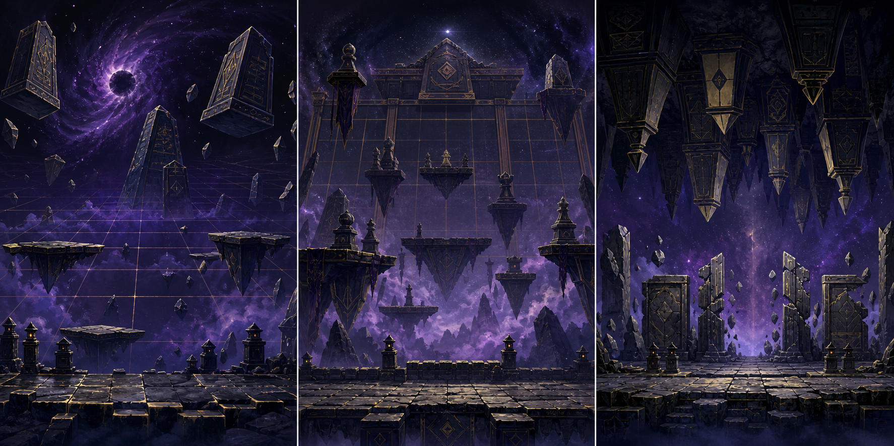

# ステージビジュアルコンセプト

この資料は、ステージ作り込み時の見た目とレイアウト判断の基準にする。
ここに置いた画像は実装用素材ではなく、ゲーム内描画・地形・背景・セットピースへ翻訳するための参照画像。

現在の Stage1 主経路は、専用背景・atlas・rect/mask catalogを使う `TerrainPieces.pieces` の個別配置SSOTへ移行済み。以後の配置調整もこの資料の方向を維持し、`stage-designer --stage 1` 上で行う。

## 共通方針

- 横スクロールのプレイ画面として、中央の移動・弾幕・敵の視認性を最優先する。
- ランドマーク、ゲート、砲台台座、中ボス戦闘エリアは `terrain_layout` / `world_events` の `world_x` 固定配置で作る。
- 背景は雰囲気を出すが、弾・敵・アイテムより主張しない。
- 破壊可能地形は壁全体ではなく、小さな出っ張り、台座、ゲート、掘削対象として置く。
- 生成画像をそのままゲームに貼るのではなく、低解像度でも読める形・色・シルエットへ分解して実装する。

## Stage1: 発熱回廊

採用方向:

- 基準は中央案。赤血球が浮く、明るめで奥行きのある血管回廊。
- 左案の赤血球感は採用するが、壁の粒状感・グロさは抑える。
- 右案の発光する腫れ・膿っぽい塊は強すぎるので、局所アクセントに留める。

ゲーム内へ落とす要素:

- 背景: `stage1_fever_corridor_bg.png` を奥行きの下地にし、既存の楕円赤血球・薄い血管ライン・赤い霞を視差演出として重ねる。
- 上下壁: `stage1_fever_terrain_sheet.png` の有機的なsurface/fill素材をcomposerで使う。ただし凸凹を細かくしすぎない。
- 破壊可能地形: 同じStage1 catalogの血栓・細胞塊を固定clotの寸法へfitする。画面端まで穴を開ける壁ではなく、通路に少し出た小さな詰まりにする。
- 砲台台座: 血栓が固まった専用素材を使い、汎用の茶色い岩や灰色ブロックにしない。

現在の実装:

- 主経路: 約395個のpieceが血管壁・血栓台座・装飾を保持する。素材種類・`x` / `y`・`role`・`collision`・反転を個別編集できる。
- 最終調整: 通路幅、surfaceの連続性、敵との位置関係は `stage-designer --stage 1` で確認して詰める。
- 継続部分: Boss用fallbackの `TerrainStrip` と、破壊可能clot・ゲートなどの `world_events` は残す。

Stage1 レイアウトの戻りどころ:

| world_x | 区間 | 意図 |
|---:|---|---|
| 0-900 | 導入 | 広い通路。赤血球背景と発熱回廊の雰囲気を見せる |
| 900-2300 | 小さな詰まり | 上下の小さな血栓と最初の砲台台座を見せる |
| 2300-4700 | 砲台台座・ゲート | 血栓台座、上下敵、短い封鎖を組み合わせる |
| 4700-5860 | 報酬区間 | 武器ゲートとCrawlerを置き、中央通路は残す |
| 5860-7050 | 中ボス・高密度区間 | 中ボス報酬と強化砲台を地形に合わせる |
| 7050-7650 | ボス前 | 最後の血栓ゲートからBossGateまで呼吸を作る |
| 7650-8500 | ボス部屋 | 事前配置した上下clotとBossを収める |
| 8500-11200 | 配置余白 | 現行 `TerrainPieces.length` の余白。必要に応じてdesignerで整理する |

## Stage2: ミーム汚染 / 控えめサイバー

採用方向:

- 基準は中央案の落ち着いた青緑トーン。
- 右案のサイバー感、斜めの崩れ、ノイズ表現を少量混ぜる。
- 背景として色が強すぎるネオンや高彩度マゼンタは避ける。

ゲーム内へ落とす要素:

- 背景: 薄い走査線、遠景の壊れた都市ブロック、低彩度の緑/青ノイズ。
- 地形: 黒いデータ塊、壊れたパネル、浮遊する足場。
- セットピース: ノイズゲート、通信障害の壁、画面端ではなく通路内に置かれた崩落ブロック。

主経路は188個の `TerrainPieces.pieces` で構成し、Stage2素材の種類・座標・衝突・反転を `stage-designer --stage 2` から個別に調整する。Boss用fallbackの `TerrainStrip` と、破壊可能な `world_events` は従来どおり残す。

## Stage3: 審査ゲート / 労働要塞

採用方向:

- 追加版中央を基準にした、抽象的な審査ゲート・労働要塞。
- ハートは小さなランプ、スタンプ、表示灯程度に留める。
- 巨大なハート、恋愛イベント会場、プロフィールカードだらけの画面にはしない。

ゲーム内へ落とす要素:

- 背景: 事務的な塔、書類束、審査窓口、ターンスタイル、カレンダーグリッド。
- 地形: コンクリートと金属の直線的な足場。
- セットピース: ゲート、審査台、砲台付き監視塔、中ボス用の封鎖エリア。

## Stage4: 将棋深淵 / ラスボス玉座

採用方向:

- 道中は左案。宇宙・盤面・浮遊する駒石碑の広がりを使う。
- ラスボスは中央案。巨大な盤面と玉座感を強める。
- 右案の天井から迫る圧迫感は一部の危険区間に使う。

ゲーム内へ落とす要素:

- 背景: 紫の深淵、薄い将棋盤グリッド、遠景の浮遊駒。
- 地形: 黒金の石板、浮遊足場、駒型の柱。
- ラスボス前: 盤面が中央に収束し、ボス戦エリアへ入る明確な門を作る。

主経路は280個の `TerrainPieces.pieces` で構成し、将棋深淵素材の種類・座標・衝突・反転を `stage-designer --stage 4` から個別に調整する。Boss用fallbackの `TerrainStrip` と、破壊可能な `world_events` は従来どおり残す。

背景は遠景の玉座城と、別速度で流れる透明中景の浮遊将棋塔を重ねる。さらに盤面グリッドと紫金の脈動光を重ね、最終ステージの儀式的な奥行きを出す。破壊可能ブロックは `shogi_void` catalogの明示素材を使い、通常地形と同じ黒金・紫晶の意匠で表示する。
